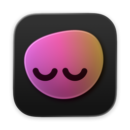
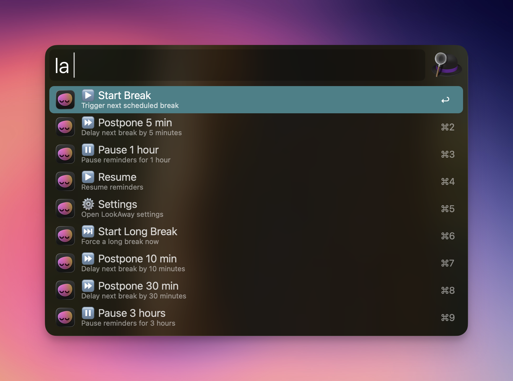

#  LookAway for Alfred

Control [LookAway](https://lookaway.app) break reminders directly from Alfred.

## Installation

1. Download the [latest release](https://github.com/hi-upchen/alfred-lookaway/releases/latest/download/LookAway.alfredworkflow)
2. Double-click the `.alfredworkflow` file to install

## Usage

Type any of these keywords in Alfred to see all available commands:

| Keyword | Description |
|---------|-------------|
| `la` | Short alias |
| `look` | Medium alias |
| `lookaway` | Full name |

Start typing to filter commands (e.g., `la pause` shows only pause options).

## Commands

| Command | Description |
|---------|-------------|
| **Start Break** | Trigger next scheduled break |
| **Start Long Break** | Force a long break now |
| **Postpone 5 min** | Delay next break by 5 minutes |
| **Postpone 10 min** | Delay next break by 10 minutes |
| **Postpone 30 min** | Delay next break by 30 minutes |
| **Pause 1 hour** | Pause reminders for 1 hour |
| **Pause 3 hours** | Pause reminders for 3 hours |
| **Pause 6 hours** | Pause reminders for 6 hours |
| **Pause 12 hours** | Pause reminders for 12 hours |
| **Resume** | Resume reminders |
| **Settings** | Open LookAway settings |

## Requirements

- [LookAway](https://lookaway.app) v1.11.3 or later
- [Alfred](https://www.alfredapp.com/) 5 with Powerpack

## License

[MIT](LICENSE)
